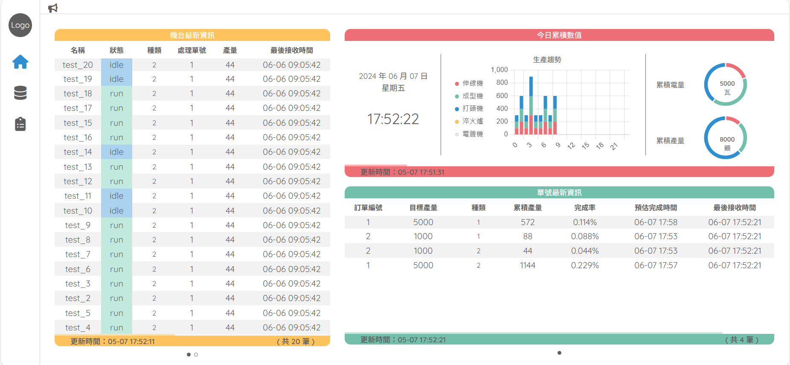

# 螺絲工廠之碳排放估算與產能分析(前端)

## 目的

節省碳排: 因應歐盟碳關稅，幫助廠商計算碳排放量，節省開銷

產能分析: 根據統計資料分析螺絲產能 

## 使用工具

前端 : Vue、 JavaScript 、HTML 、CSS

[後端](https://github.com/Yuuquoi/screw) : Java 、Spring Boot 、MySQL

## 畫面呈現
### 首頁
顯示機台、訂單與生產趨勢的各項資料

### 機台
點擊機台名稱獲取該機台的基本資料、維修紀錄、績效分析

.png)

.png)

.png)

### 訂單

點擊單號獲取該筆訂單的訂單資料、製造資訊、績效分析

.png)

.png)

.png)

